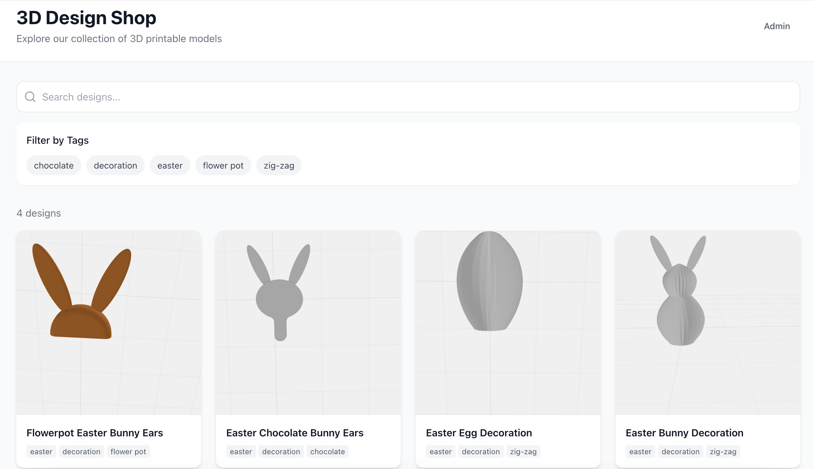
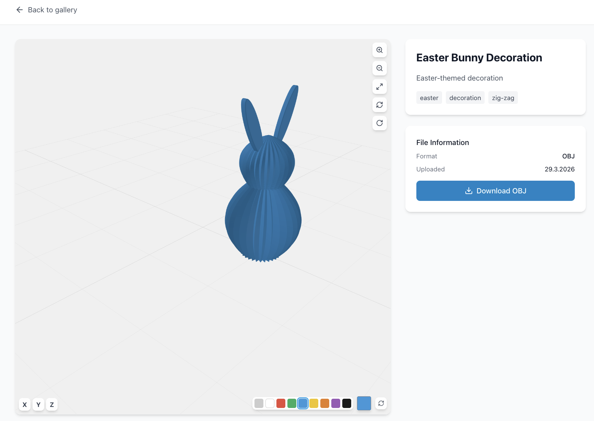

# 3D Design Shop

A web application for showcasing and viewing 3D printing models directly in the browser. Features interactive 3D model viewing using Three.js, tag-based filtering, and an admin upload system.



## Features

### For Visitors
- **Gallery View**: Browse all 3D designs in a responsive grid layout
- **Search & Filter**: Search by name, description, or tags; filter by multiple tags
- **3D Model Viewer**: Rotate, zoom, and pan around 3D models directly in the browser
- **Download**: Download original OBJ/GLTF/GLB files



### For Admin
- **Simple Authentication**: Single password protection
- **Drag & Drop Upload**: Easy file upload for new designs
- **Live 3D Preview**: Position the camera and capture the perfect thumbnail
- **Metadata Management**: Add name, description, category, and tags

## Tech Stack

| Layer | Technology |
|-------|------------|
| Backend | Bun + Express |
| Frontend | React + Vite + Tailwind CSS |
| 3D Rendering | Three.js |
| Database | SQLite (bun:sqlite) |
| Auth | JWT |

## Getting Started

### Prerequisites

- [Bun](https://bun.sh/) runtime installed

### Installation

```bash
# Install dependencies
cd backend && bun install
cd ../frontend && bun install

# Configure environment
cd backend
cp .env.example .env
# Edit .env and set your ADMIN_PASSWORD and JWT_SECRET
```

### Running

```bash
# Terminal 1: Start backend
cd backend
bun run dev

# Terminal 2: Start frontend
cd frontend
bun run dev
```

Visit `http://localhost:5173`

- **Gallery**: `http://localhost:5173/`
- **Admin Panel**: `http://localhost:5173/admin`

## Usage

### Uploading a Design

1. Go to `/admin` and enter your password
2. Drag and drop an OBJ, GLTF, or GLB file
3. Use the 3D preview controls to position the model
4. Fill in metadata (name, description, category, tags)
5. Click "Upload with Current View as Thumbnail"

### 3D Viewer Controls

| Control | Action |
|---------|--------|
| Mouse drag | Rotate around model |
| Scroll wheel | Zoom in/out |
| Right-click drag | Pan view |
| Zoom buttons | Move camera closer/further |
| Fit to View | Auto-frame entire model |
| Reset View | Return to default position |
| Auto-Rotate | Toggle spinning camera |
| X / Y / Z buttons | Rotate model 90° around axis |

## Project Structure

```
3DDesignShop/
├── shared/           # Shared types (optional)
├── backend/          # Bun/Express API server
│   ├── src/
│   │   ├── db/           # SQLite database
│   │   ├── routes/       # API endpoints
│   │   └── middleware/   # Auth
│   └── uploads/          # File storage
├── frontend/         # React SPA
│   └── src/
│       ├── components/    # ModelViewer, UploadPreview
│       ├── pages/        # Gallery, Admin, DesignViewer
│       └── lib/          # API client
└── DESIGN.md         # Architecture documentation
```

## API Endpoints

### Public
- `GET /api/designs` - List designs
- `GET /api/designs/:id` - Get single design
- `GET /api/designs/tags` - Get all tags

### Admin (requires JWT)
- `POST /api/admin/designs` - Upload new design
- `DELETE /api/admin/designs/:id` - Delete design

## Environment Variables

```env
ADMIN_PASSWORD=your-secure-password
JWT_SECRET=your-very-long-random-secret
PORT=3000
UPLOAD_DIR=./uploads
FRONTEND_URL=http://localhost:5173
```

## License

MIT
